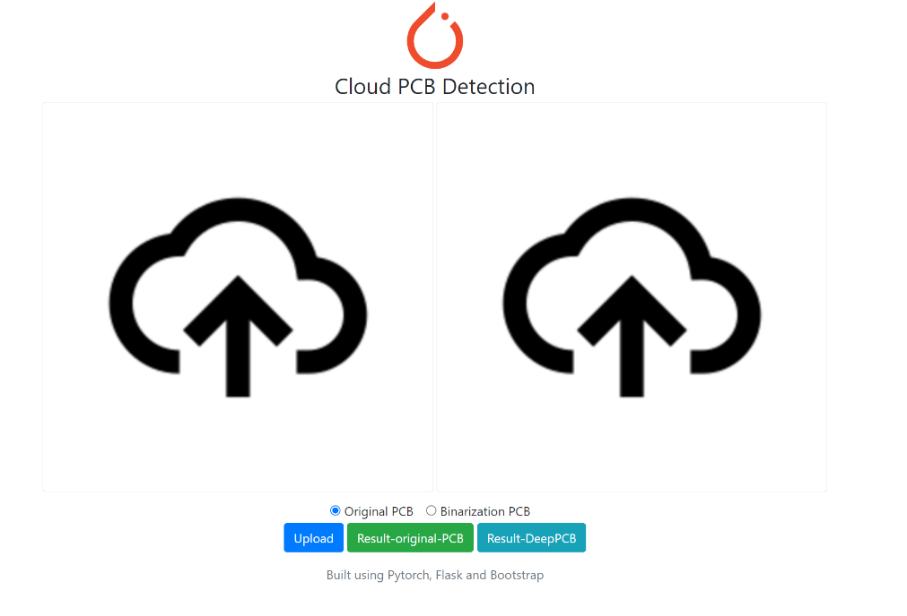
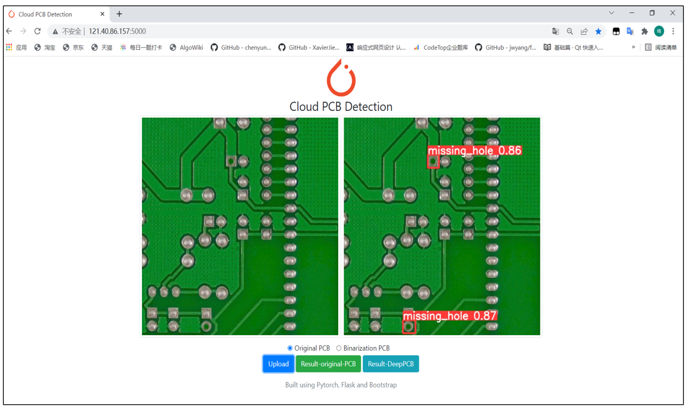
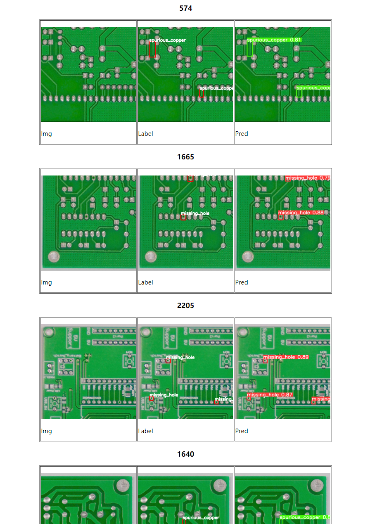
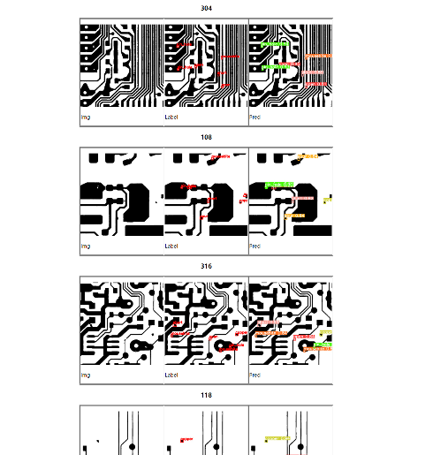

# Web_PCB

## Introdection
Implement the defect detection model deployed on cloud server based on YOLOv5, including online end detection and result demonstration; Two datasets are included (Peking University pcb defect dataset and DeepPCB dataset). The project is implemented by python-flask.

## Environment
```
pip install requirements.txt
```

## How to use
* ```python app.py```

* Main Interface
<div align="center"></div>

* Defect Detection On The Cloud (Peking University pcb defect dataset)
<div align="center"></div>

* Test result presentation (Peking University pcb defect dataset)
<div align="center"></div>

* Test result presentation (DeepPCB dataset)
<div align="center"></div>